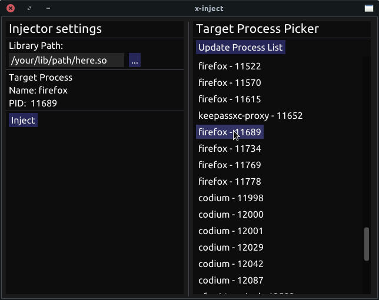
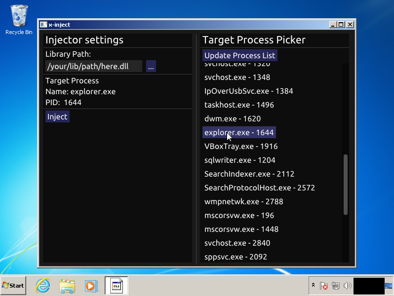

# x-inject
Library injector for Windows and Linux. Powered by <a href="https://github.com/rdbo/libmem">rdbo/libmem</a>  

# How to use
It is very simple. Select the target process in the right panel and the library you want to inject in the left panel. Then, just click 'Inject'.  

# How to compile
On **Linux**, go to the folder `build/linux` and run the command `make`. It will build for x86 (x-inject_32) and for x64 (x-inject_64). If you want to build for a single architecture, just run `make <architecture>`. Check the requirements.  
  
On **Windows**, you can build through the Visual Studio solution on the folder `build/win`. Run it on Visual Studio and the just normally compile. Check the requirements.  
  
# Showcase
  

